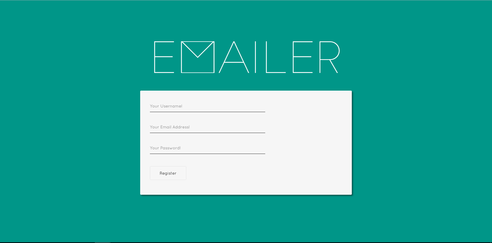
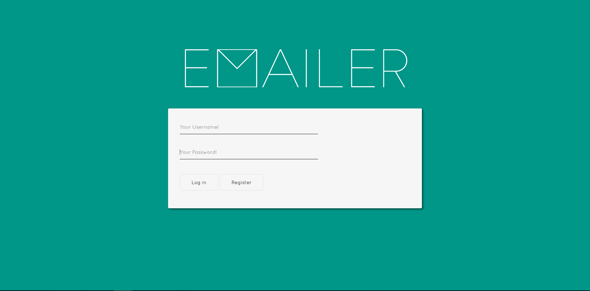
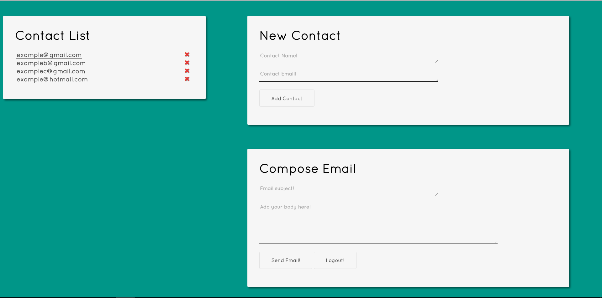

# Emailer

This is a very basic newsletter application in which users can create an account and login, add/delete contacts and send a newsletter to those contacts. 

I also want to add a group function so that users can put their contacts into different groups and send emails to specific groups, and also to just email a single contact. 

Here are a few screenshots:

Register Page

Login Page

Main Page

